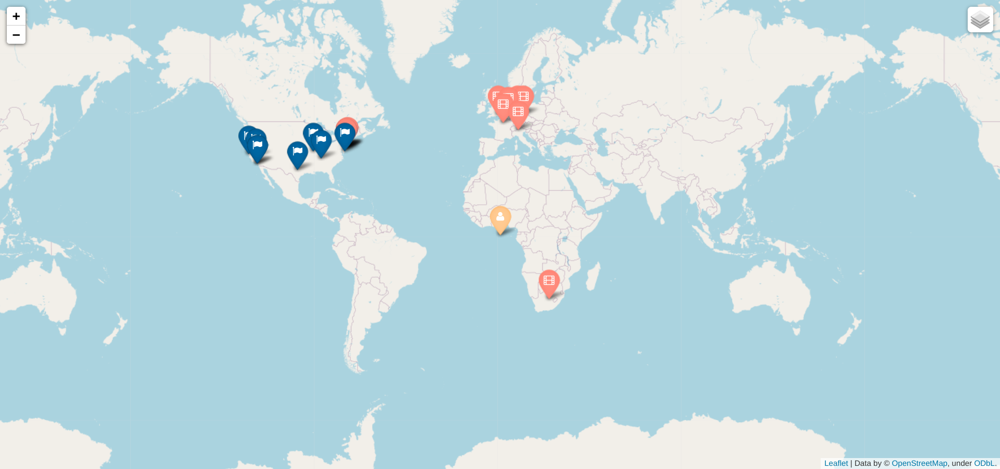
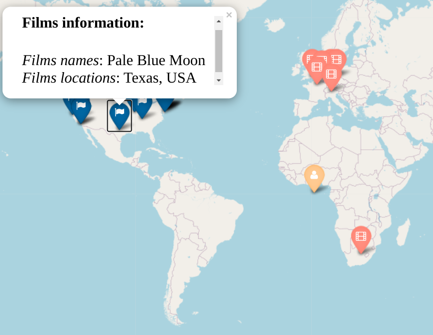
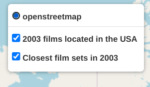

# web_map

This module creates a web map based on the data about films.
On the map you can see markers of closest to the point films created in the particular year and that year films created in the USA.

## Installations

Use package manager pip to install folium, haversine and geopy:

```bash
pip install folium
pip install haversine
pip install geopy
```

## Usage

To run the program from the command line type ‘python’, name of the module (‘main.py’), films year, starting point latitude and longitude, a path to the file with films data.

```bash
python main.py 2003 1 1 locations_small.list
```
## Output

An HTML file will be created (web_map.html), and it looks like this in the browser:



**There are three types of markers**:
* *yellow* - your starting point
* *light red* - closest that year films
* *blue* - that year films created in the USA


If you click on markers, you will get more information about that particular film.



Here you can choose layers you want to be shown on the map.

